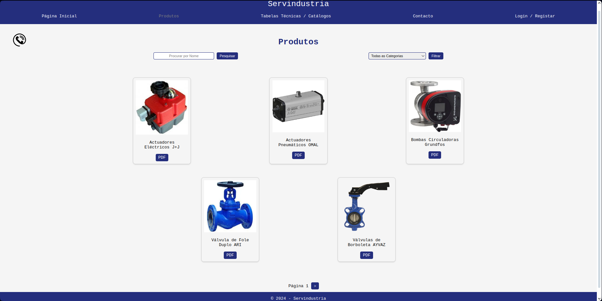

# Servindustria Web Application

The Servindustria Web Application is a fully functional web app developed for Servindustria, a company dedicated to the import, resale, and commerce of industrial products, accessories, and equipment. This application serves as a digital front for the company, providing features like product browsing, technical tables and catalogs, contact forms, and admin functionalities.

## Features
- Admins (once authenticated) can:
    - Add/remove products, technical tables / catalogs or product categories;
    - See the call requests and the contact forms sent by the users.

- Users can:
    - Login;
    - Send call requests (so that the company can call him/her once it's possible);
    - Send contact forms;
    - See the products and filter them by category or name;
    - See the technical tables and catalogs;
    - See the contact page.

## Future Goals

- Add favourite products to the users.

## Screenshots

### Home


### Products


### Call Request Popup (in any page)


### Authentication


### Contact


### Admin Panel (Manage Items)


### Admin Panel (Call Requests - Seen and Unseen)


### Admin Panel (Contact Forms - Seen and Unseen)


## Prerequisites

Before you begin, ensure you have met the following requirements:
- .NET 8.0 SDK
- SQL Server (Local or remote with a valid connection string)
- Any IDE that supports ASP.NET development (e.g., Visual Studio, Visual Studio Code)

## Setup

To set up the Servindustria Web Application, follow these steps:

1. Clone the repository to your local machine:
   ```bash
   git clone https://github.com/joaobaptista03/Servindustria-ASPNETRAZOR.git
   ```

2. Navigate to the project directory:
   ```bash
   cd Servindustria-ASPNETRAZOR
   ```

3. Ensure the connection string in appsettings.json matches your SQL Server configuration;

4. Run the application:
   ```bash
    dotnet run
   ```

## Usage

Once the application is running, navigate to https://localhost:5001 (or your configured port) to view the web application.

## Contributing

Contributions to the Servindustria Web Application are welcome. Please adhere to this project's code of conduct.

1. Fork the Project
2. Create your Feature Branch (git checkout -b feature/AmazingFeature)
3. Commit your Changes (git commit -m 'Add some AmazingFeature')
4. Push to the Branch (git push origin feature/AmazingFeature)
5. Open a Pull Request